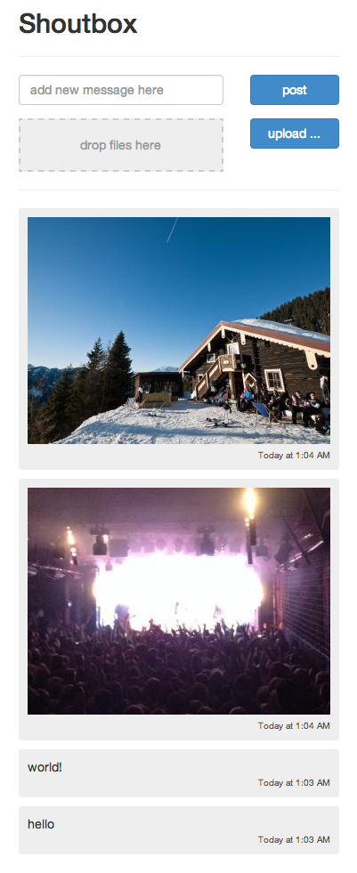

## How to

1. create database and run `database/create.sql` to setup tables
2. copy/move `server/config.example.php` to `server/config.php` and enter your database config
3. run, e.g. `php -S 0.0.0.0:8080`

